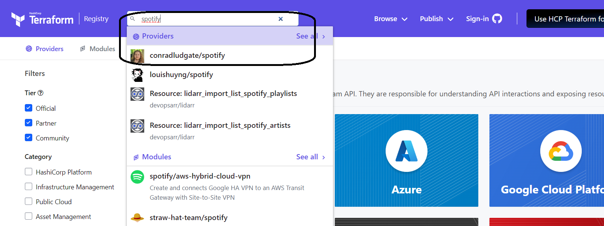
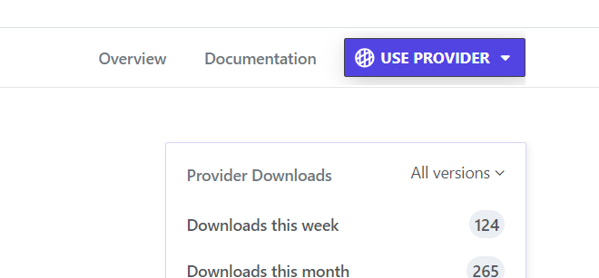
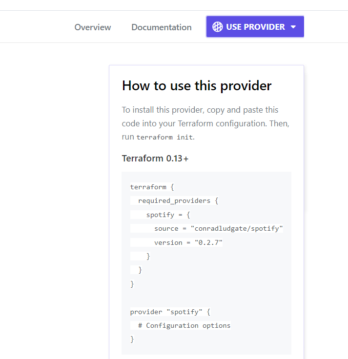
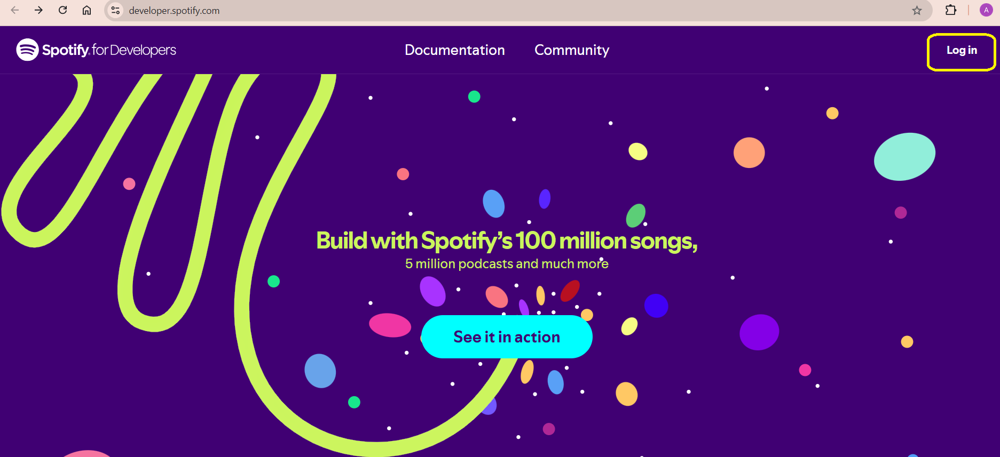
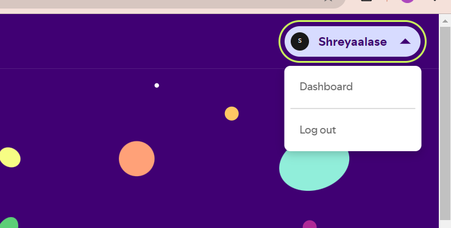
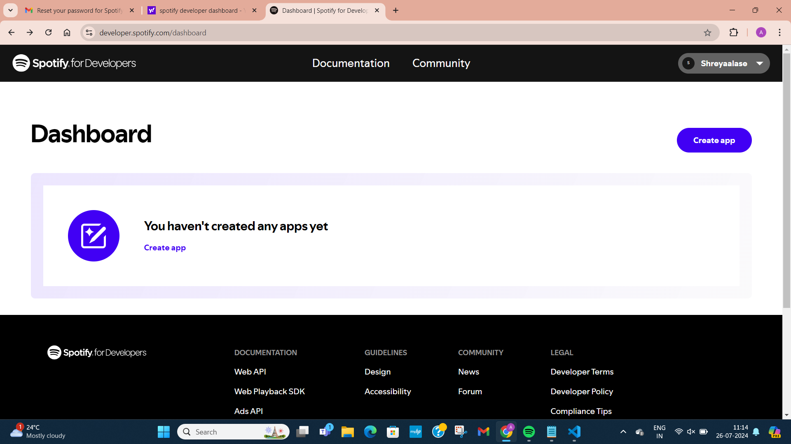
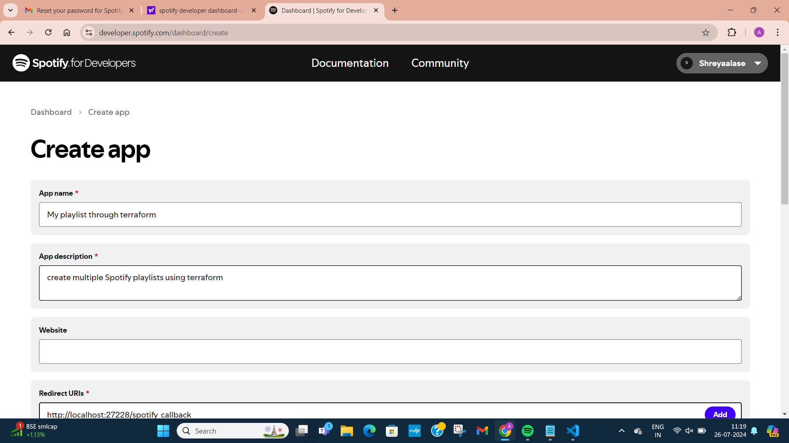
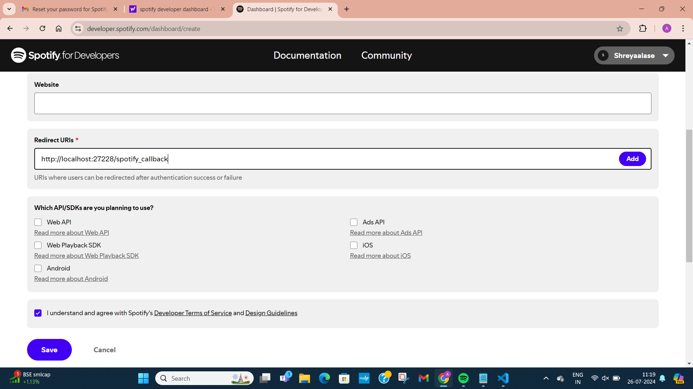
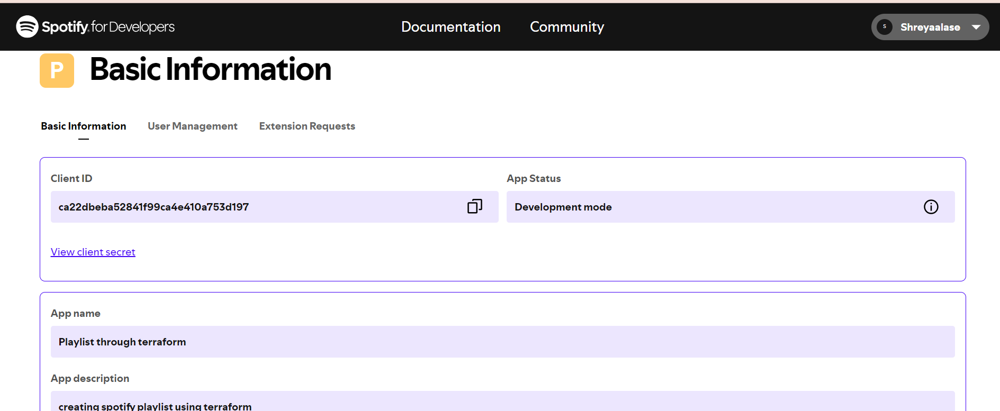

# Spotify-Terraform

## Project Overview

This project involves using Terraform to create multiple Spotify playlists for different occasions like morning, evening, party night, etc. Terraform will be used to automate the creation and management of these playlists.

## Prerequisites

1. **Terraform Installed**: Ensure Terraform is installed on your machine.
2. **Docker Installed**: Make sure Docker is installed and running.
3. **Spotify Account**: You need a Spotify account (without premium access)
4. **Spotify Developer Account**: Register and create an application to get the Client ID and Client Secret.
5. **Spotify Provider for Terraform**: Install and configure the Spotify provider for Terraform.
6. **VS Code Editor**: Recommended for editing Terraform files.

# Steps to complete the project

**1. Creating Terraform Code and defining Provider**  
  create one file named provider.tf  
  For the provider, search for providers terraform in browser then go to first link and search for spotify and choose first provider   

  

 to use the provider, click on use provider option  

  

copy the code & paste in vs code under provider.tf  

**2. Create an app**  
To interact with Spotify's API, you need a Client ID and Client Secret.  

go to Spotify Developer Dashboard. Login with your spotify acccount  

  

After logging in, go back and click on account to go to dashboard.

   

click on checkbox and accept the terms.  
we have to create an app then click on create app.

fill the details name, description  
Redirect URIs: http://localhost:27228/spotify_callback  
 then click on chechbox and save  
 
   
To get Client id and Client secret > Settings > Client ID (Copy the ID) and click on view client secret to get client secret 
 
Create a file .env then paste here the id and secret

now run the docker container > docker run -it -p 27228:27228 --env-file .env ghcr.io/conradludgate/spotify-auth-proxy
you'll get a link then click on that link, agree and you'll get msg as authorization successful

put the api key in .tfvars file

we want our container to continue to running so open new terminal and write > terraform init

we're ready to create our playlist
create one file as playlist.tf , in the file define resource and name of playlist
and add tracks by searching a song in spotify and copy the id

now run terraform plan command then terraform apply -auto-approve
then check for playlist in spotify

to play a song, everytime we need to put a id instead we can use data block in terraform
we are creating another playlist in playlists.tf
